# Architecture

**Recovery Controller** — expected-value gated revenue recovery.
Razorpay AI Buildathon 2026 · Track 03

Every diagram below renders natively on GitHub. Every package name, table name, enum value and
edge is taken from the code, not drawn from memory — the dependency graph in §2 is the output
of `pnpm lint:boundaries`, which is the same check that fails the build.

---

## Contents

1. [The agent loop](#1-the-agent-loop) — detect, determine, execute, and the exit
2. [Package graph](#2-package-graph) — the real module dependencies, and the wall through them
3. [The Chinese wall](#3-the-chinese-wall) — why the numbers carry information
4. [One decision, end to end](#4-one-decision-end-to-end) — the path a single failure takes
5. [The gate and the bounds](#5-the-gate-and-the-bounds) — every reason an action can be refused
6. [Five risk classes, one engine](#6-five-risk-classes-one-engine) — what generalises and what differs
7. [The dual-write problem](#7-the-dual-write-problem) — crash-resume, and why it cannot guess
8. [Data model](#8-data-model) — tables and the invariants they enforce
9. [The evaluation harness](#9-the-evaluation-harness) — six arms, one population, a ceiling
10. [The improvement loop](#10-the-improvement-loop) — the agent proposes, a human decides
11. [Runtime topology](#11-runtime-topology) — what processes exist and what they touch
12. [Where the AI is, and is not](#12-where-the-ai-is-and-is-not)
13. [Trust boundaries](#13-trust-boundaries)

---

## 1. The agent loop

The brief asks for an agent that **detects** revenue at risk, **determines** the right
intervention, and **executes a bounded recovery workflow**. Those three verbs are the loop.

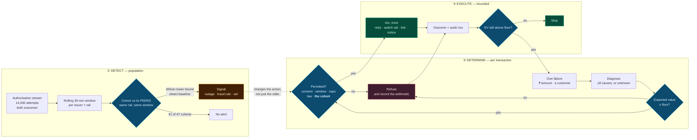

Two things about that diagram are the whole submission.

**The dotted edge points at a bound, not at a probability.** A detected outage does not make
the engine *less optimistic* about a retry — it forbids the re-presentment and lets the rail
switch through. The population changes the **action**, which is what "root cause → recovery
action" means and what no per-transaction rule can do.

**The loop's exit is a gate, not a counter.** Most systems respond to a failure by retrying,
and a card retry costs ₹3.50 whether it works or not — so retrying everything can spend more
than it collects. This one prices each candidate action first and **usually declines**: on
seed 42, of 544 decisions across 328 transactions, 296 fired and **248 were refused**.

```
  probability × (amount × contribution margin)  −  cost  ≥  floor
```

Three properties follow from that line, and they are the whole design:

```
  probability × (amount × contribution margin)  −  cost  ≥  floor
```

Three properties follow from that line, and they are the whole design:

- **Margin, not gross.** Recovering a rupee is worth its margin. A ₹4 lakh invoice at 8% and a
  ₹499 subscription at 26% over six remaining cycles are closer in value than their sizes look.
- **Stopping is derived, not configured.** No `maxAttempts` constant does the real work. A
  sequence ends when expected value crosses the floor. The schedule length remains a hard
  ceiling, but on most transactions economics binds first.
- **Integers end to end.** Paise as `bigint`, probabilities and margins as basis points. There
  is no floating-point number in the money path and no constructor that would let one in.

---

## 2. Package graph

Nine packages and one app. The edges below are the actual `@rc/*` dependencies declared in each
`package.json`, and the two forbidden edges are the ones `pnpm lint:boundaries` fails on.

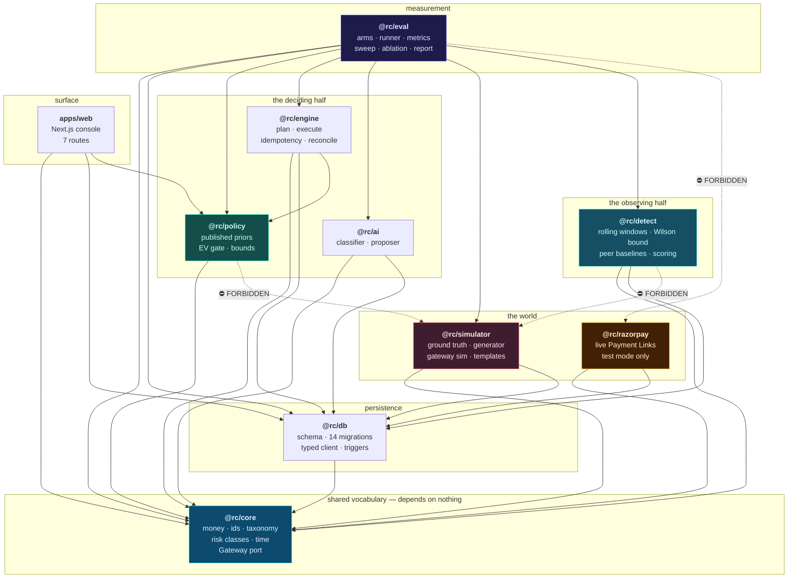

`@rc/core` depends on **nothing**, and that is load-bearing rather than tidy. It is the only
package both sides of the wall may import, which makes it the only safe home for the `Gateway`
port — the one contract the policy engine and the simulator must both see.

The port lived in `@rc/engine` once. The simulator imported it, the engine imports `@rc/policy`,
and that produced a two-hop path from the simulator to the policy engine that every
direct-edge rule waved through. The rules are written on **reachability** because of it.

---

## 3. The Chinese wall

The single most distinctive property of this system, and the reason any measured number here
carries information rather than restating an assumption.

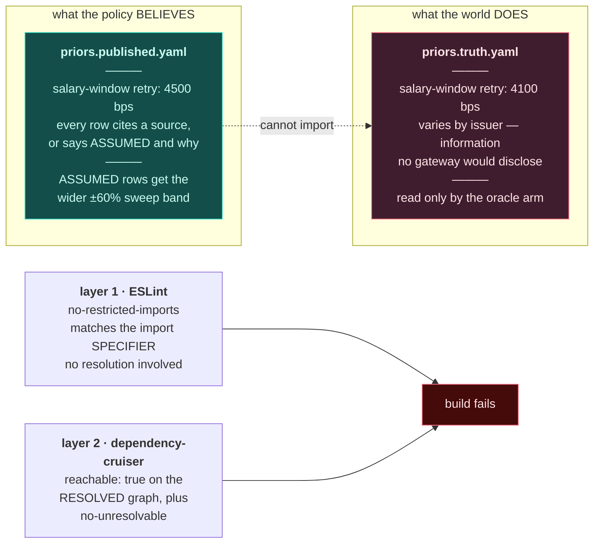

**Why two layers.** The first version used only resolved-path matching, and it *silently passed
with a forbidden import in the file*. In a pnpm workspace `@rc/policy` resolves through a
`node_modules` symlink, and the config excluded `node_modules` from the graph — so the one
import the rule existed to forbid was the one import it could not see.

A boundary nobody has tried to break is not a boundary. Both layers were verified by
deliberately adding the forbidden import and confirming each fails independently.

**What the wall buys.** If the policy could read the truth, "our strategy won" would be an
identity rather than a measurement. The policy is *permitted to be wrong*, and the sensitivity
sweep in §9 measures how wrong it can be before it stops paying for itself.

---

## 4. One decision, end to end

The path a single failed payment takes. Nine steps, each in one package.

```mermaid
sequenceDiagram
    autonumber
    participant SIM as @rc/simulator
    participant AI as @rc/ai
    participant POL as @rc/policy
    participant ENG as @rc/engine
    participant GW as Gateway port
    participant DB as Postgres

    SIM->>DB: seed txn + failure_event<br/>(deterministic id, logical_ref)
    Note over SIM,DB: true cause written where no<br/>decision path can reach it

    AI->>AI: read gateway_description<br/>"51 NSF paisa nahi tha"
    AI->>DB: classification → insufficient_funds<br/>+ calibrated confidence
    Note over AI: output is a Zod ENUM —<br/>a model can index the taxonomy,<br/>never emit an instruction

    ENG->>DB: load observed history<br/>attempts · contacts · consent · promise
    ENG->>POL: scheduleEntry(cause, attempt, riskClass)
    POL-->>ENG: retry @ salary_window
    ENG->>POL: prior(cause, attempt, timing, kind)
    POL-->>ENG: 4500 bps — PUBLISHED, never truth

    ENG->>POL: evGate(amount, margin, cycles, p, costs, floor)
    POL-->>ENG: pass — net clears the floor

    ENG->>POL: checkAttemptBounds + checkContactBounds
    POL-->>ENG: allow

    rect rgb(20, 40, 60)
    Note over ENG,DB: TX 1 — reserve
    ENG->>DB: decision(pending) + fee hold + audit
    end

    ENG->>GW: attempt(idempotencyKey, amount, rail, context)
    GW-->>ENG: outcome

    rect rgb(20, 40, 60)
    Note over ENG,DB: TX 2 — settle
    ENG->>DB: outcome + decision(settled) + message_send + audit
    end
```

**Classification happens once per transaction, not per attempt.** A retry does not re-diagnose
the original failure, and re-classifying would multiply model cost by attempt count to produce
the same answer.

**A quarantined transaction arrives at step 5 as `unknown`**, whose policy entry permits no
attempts and escalates. No intervention fires on an unidentified cause.

---

## 5. The gate and the bounds

Every reason an action can be refused, in the order they are checked. **Order is the design:**
authorisation before economics, because there is no point pricing an action nobody is permitted
to take. A transaction blocked by quiet hours should report quiet hours, not a marginal
expected value.

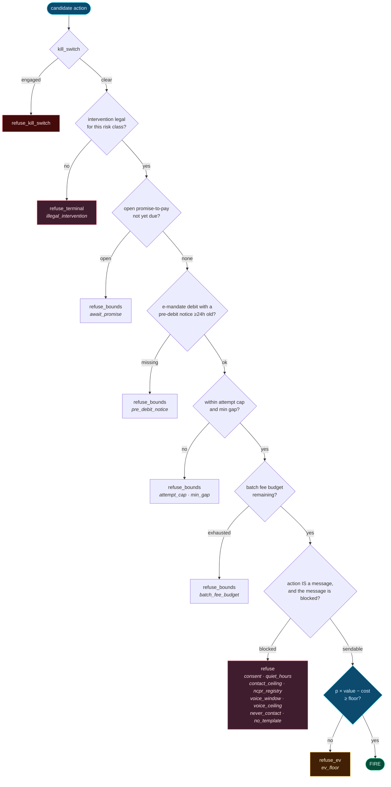

**Two bound checks, not one, and the split is deliberate.** `checkAttemptBounds` asks *may this
attempt happen?*; `checkContactBounds` asks *may this customer be messaged right now?* A retry
at 03:00 is fine; the SMS about it is not. Collapsing them would mean quiet hours silently
costing recoveries — declining a good retry because an optional nudge was blocked.

**The exception is a message-only action.** For a payment link, a pre-debit notice or a
re-authorisation request, the message *is* the intervention — so a blocked contact means the
action does not happen. Getting that wrong inflated this system's own reported results by two
thirds on the messaging classes; see `FAILURES.md` §1.

**Every refusal carries its arithmetic and its rule.** `decision.refuse_rule` is a column, so
"what did the consent bound cost us this batch?" is a query. The answer is **₹1,70,547 of
expected recovery, 88% of the entire shortfall against the ceiling** — stated in the report
rather than left as an unexplained gap.

---

## 6. Five risk classes, one engine

The brief names seven directions across three domains. They are the same shape of problem: an
amount of money attached to a customer, with a cause, on which a bounded and priced
intervention may be attempted.

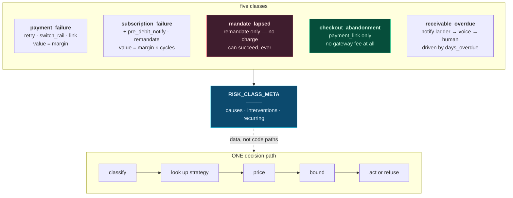

Each class differs in exactly three ways, and all three were **already inputs the gate took**:

| | Differs | Consequence |
|---|---|---|
| **Which causes** | An invoice cannot decline for insufficient funds | 18 reason codes, partitioned by class |
| **Which interventions** | An abandoned cart cannot be retried — nothing was charged | 9 interventions, `incursGatewayFee` distinguishes 2 that charge |
| **Value and cost** | A subscription is worth its remaining term; a cart nudge costs 18p not ₹3.50 | `valueCycles` multiplier; fee gated on the action |

**Two invariants make that safe rather than merely tidy.**

A policy that schedules an intervention a class does not permit **fails to load** — including a
base entry inherited by a class that would not permit it. And a retry on a lapsed mandate is
refused as `illegal_intervention` *before it is priced*, because reporting it as `refuse_ev`
would suggest a better-priced version of the same action might work.

### The seven directions, and where each lives

| Direction | Mechanism | Enforced by |
|---|---|---|
| Smart retry policy | 18-code taxonomy; a class exists only if it earns a distinct intervention | `taxonomy.ts` · `policy.default.yaml` |
| Mandate retry sequencer | A charge on a mandate rail is refused unless a notice was **delivered** ≥24h earlier | `pre_debit_notice` bound |
| Failed-subscription recovery | Value multiplies by `lifetime_cycles` | `valueCycles` in `ev.ts` |
| Checkout drop-off | Four causes by funnel stage; no fee; whole cost is the message | `checkout_abandonment` class |
| B2B receivables | Five causes, five strategies; ladder climbs channel then stops | `receivable_overdue` class |
| Promise-to-pay | Open promise **blocks** the ladder; records `await_promise` | `promise` table · `promise_open` |
| Hinglish voice | NCPR override · 10:00–19:00 window · 1 call/week · ~22× SMS cost | `voice` channel · `voice_*` bounds |

---

## 7. The dual-write problem

A fired attempt spans three steps that cannot be one atomic operation, because the middle one
leaves the database.

```mermaid
sequenceDiagram
    autonumber
    participant W as worker
    participant DB as Postgres
    participant GW as gateway

    rect rgb(20, 40, 60)
    Note over W,DB: TX — reserve
    W->>DB: decision(pending) · fee hold · audit
    end

    W->>GW: attempt(key, amount, rail, context)
    Note over W,GW: ⚡ CRASH HERE is the interesting case

    rect rgb(20, 40, 60)
    Note over W,DB: TX — settle
    W->>DB: outcome · decision(settled) · audit
    end
```

After a crash the process comes back **not knowing whether the dispatch reached the gateway**.
Guessing either way is wrong: assume it did and a recoverable payment is abandoned; assume it
did not and the customer may be charged twice.

So it does not guess.

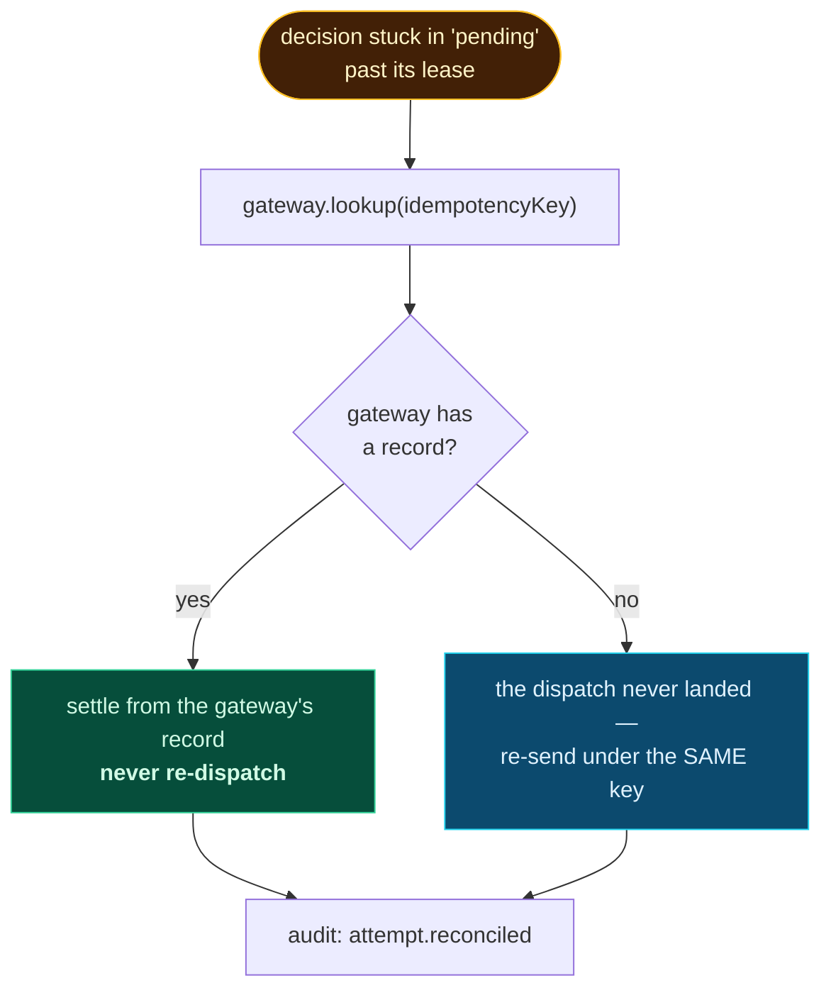

**The idempotency key is derived, not random:** `sha256(txn_id | attempt_no | policy_version)`.
A restarted process recomputes the identical key, so the gateway deduplicates it and a partial
unique index refuses the duplicate row. Exactly one charge exists either way.

`FOR UPDATE SKIP LOCKED` lets several workers reconcile concurrently without two of them
claiming the same row.

**A bug worth recording.** `decision.updated_at` once defaulted to `now()` — the database's
wall clock — while every other timestamp in a simulated run is on the caller's clock, set in
June 2026. The reconciliation lease compared a 2026 cutoff against a 2025 wall clock and
matched nothing. The demonstration appeared to succeed while proving the opposite of its claim.
Migration 008 exists for that reason.

---

## 8. Data model

Nineteen tables and one derived view, across thirteen migrations. The relationships that matter:

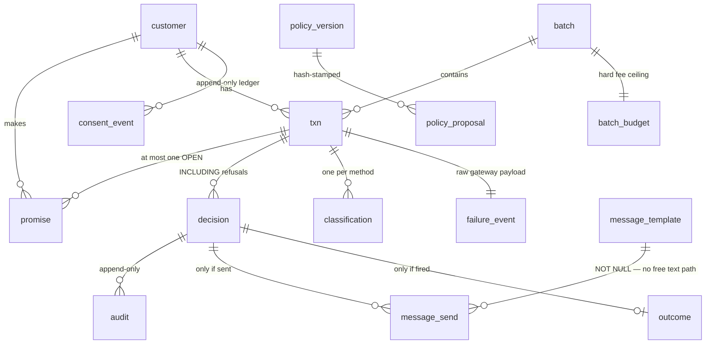

### Invariants the database enforces, not the code

| Invariant | Mechanism |
|---|---|
| The audit trail cannot be rewritten, deleted **or truncated** | triggers, including on `TRUNCATE` |
| A consent withdrawal cannot be un-withdrawn | append-only `consent_event`; `consent_current` is a view |
| A fired decision must carry an idempotency key; a refusal must not | `decision_fire_is_identified`, both halves |
| One idempotency key, one decision | partial unique index |
| A settled decision cannot return to pending | state-machine trigger |
| A failed attempt cannot have recovered money | `outcome_recovery_requires_success` |
| Spend cannot pass the batch ceiling | `batch_budget` CHECK + row lock |
| A template cannot be "registered" without a DLT id | `template_registered_has_dlt_id` |
| Only a charging action may name a rail | `decision_rail_only_when_charging` |
| A refusal must name its rule; a fired decision must not | `decision_refusal_names_its_rule` |
| A subscription cannot exist without its horizon | `txn_subscription_has_horizon` |
| A lapsed mandate must have **no** mandate reference | `txn_lapsed_mandate_has_no_ref` |
| At most one open promise per transaction | partial unique index |

**Why the table is called `decision` and not `attempt`.** A refusal is not an attempt. If
refusals lived in an `attempt` table they would consume `attempt_no`, and "attempt 2 of 2" would
start counting the times the engine declined to act — which is exactly backwards, since
declining is what preserves the budget. So: one row per **evaluation**, with the expected-value
arithmetic snapshotted on every one, because *"why didn't you try?"* is the question this system
exists to answer.

---

## 9. The evaluation harness

Six arms over one identical seeded population, so a difference between them is a difference in
strategy rather than in luck.

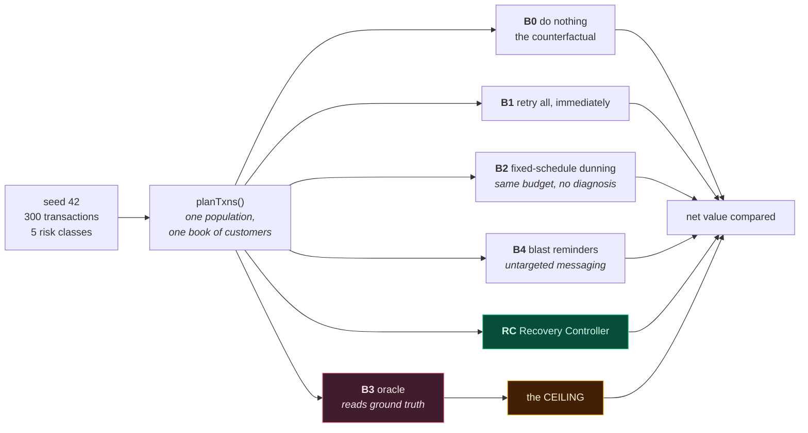

**B2 is the comparison that matters.** B1 takes one attempt where RC takes up to three, so its
gap could be dismissed as volume. B2 removes that objection — same cadence, same three-attempt
budget, no diagnosis. Whatever separates them is the value of *knowing why the payment failed*.

**B4 exists because two of the five classes cannot be retried at all.** Without an untargeted
*messaging* baseline, checkout abandonment and overdue receivables would only be measurable
against doing nothing — a much easier bar than the payment classes are held to.

**B3 is a ceiling, not a strategy.** It reads the per-issuer effect no real policy can observe
and plays optimally against the true distribution. Nothing that reads the outcome before
choosing the action can ship. It is also **bounded by law rather than preference**: it ignores
the EV floor, the attempt cap and the contact ceiling because those are a merchant's choices —
but it does *not* ignore the pre-debit notification requirement, because an oracle that debits
without notice is not a ceiling but a fantasy.

### Robustness

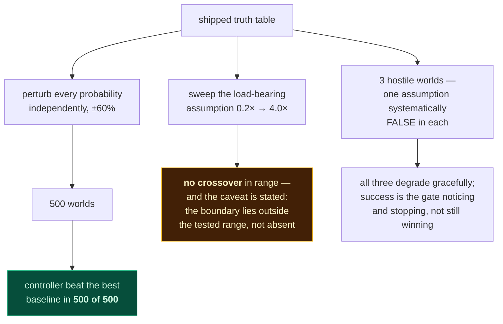

**The sweep once found a silent bug the tests missed.** A perfectly flat threshold curve meant
the salary-window probability could not matter — because a cumulative-clock error meant the
salary-window retry *never fired*, on any transaction, ever. ₹1.08 lakh of recoverable value, in
silence, with 141 correct-sounding refusals per batch. Recovery went from 62.4% to 91.8% of the
then-ceiling once fixed. `FAILURES.md` §3.

**The sweep runs the same code.** `planTxns`, the arms, `planNext`, the same gate, the same
bounds, the same truth model — only persistence is skipped. An integration test asserts the
in-memory sweep and the database runner fire the identical attempts and recover the identical
transactions, and that net value differs by exactly one documented quantity.

---

## 10. The improvement loop

The agent proposes; a person decides; a held-out seed judges.

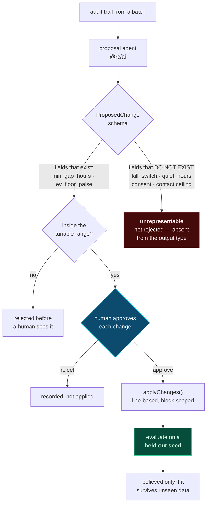

**The safety property is the schema, not the prompt.** The agent cannot propose relaxing a
safety bound because those fields are absent from the type it emits. A malformed or adversarial
proposal cannot reach them — there is nothing to reach.

**Held-out evaluation is not decoration.** One approved proposal predicted a gain and measured
a *loss* on unseen data. A change tuned on one batch that only helps that batch has learned the
noise, and that is exactly what the step exists to catch.

**`applyChanges` is line-based and block-scoped, after a real bug.** It was a regex scoped to a
reason code's block by a lazy quantifier — which held only while each code appeared once in the
file, and stopped holding when per-risk-class overrides arrived. Asking to change
`card_expired.min_gap_hours` let the match run past the end of the block and silently rewrite
the *subscription override's* value instead. `FAILURES.md` §13.

---

## 11. Runtime topology

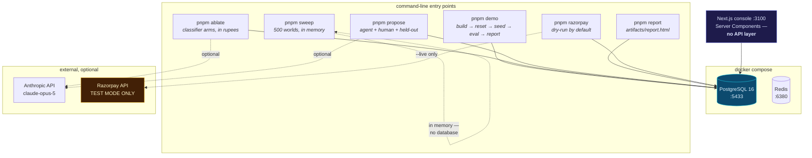

**Everything works with no `.env` and no network.** `DATABASE_URL` defaults to the Compose URL;
without an Anthropic key the LLM arm skips with a clear message and the keyword arm reports on
its own; without Razorpay keys `pnpm razorpay` runs as a dry run and prints the exact JSON it
would POST.

**The console has no API layer.** Server Components query Postgres directly, so there is no
route handler to keep in sync with the page that reads it. Aggregation happens in TypeScript
rather than SQL, because `value = recovered × margin_bps` must use the identical rounding as
the gate that decided the action — Postgres bigint division truncates while `mulBps` rounds
half away from zero, and a page disagreeing with the engine by a paise per row is worse than no
page.

**Razorpay is strictly additive, and that is enforced.** Two build-failing rules: the eval,
simulator, policy and engine may not reach `@rc/razorpay` transitively, and `@rc/razorpay` may
not reach `@rc/policy`. So no network call can enter the measurement path, and the gateway
client can never decide anything.

---

## 12. Where the AI is, and is not

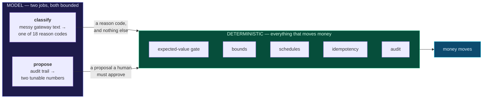

There is **no model in the decision path**. The LLM's contribution arrives upstream as a reason
code and its influence ends there.

**Three properties bound prompt injection, and the second is a mechanism rather than an
intention:**

1. The prompt frames the failure text as untrusted data.
2. The output is a **Zod enum** over the taxonomy. A model can *index into* the codes; it cannot
   *become* an instruction. A value outside the enum is rejected, not trusted.
3. Even a successful steer is bounded by everything downstream. The worst an injection achieves
   is one wrong reason code, which then meets a published prior, the gate, a schedule and a fee
   budget. It cannot widen a bound, raise a cap, or authorise an unbudgeted attempt.

Every batch deliberately contains injection attempts (3%) and novel strings the taxonomy has
never seen (12%), so behaviour under attack is measured rather than asserted.

**Messaging is registered, not generated.** `message_send.template_id` is NOT NULL against a
DLT-registered row. There is no column in which free-form model output could be sent. The model
fills variables inside an approved body, and may draft new templates as
`draft_pending_review` for a human to register. Hinglish variants are registered templates
selected by `customer.preferred_language` — the only version of "Hinglish recovery" that could
actually go live.

---

## 13. Trust boundaries

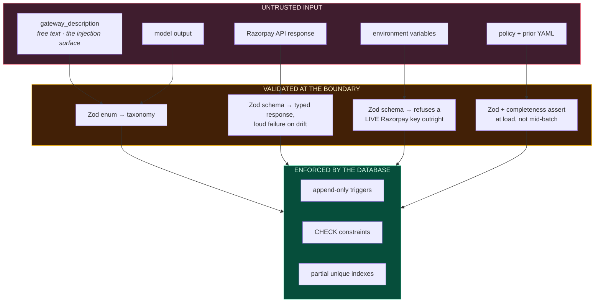

| Surface | Control |
|---|---|
| SQL injection | Kysely parameterises everything. No string-built SQL exists. |
| Prompt injection | Output is an enum, not a string. Bounded downstream regardless. |
| Money precision | `Paise` is a branded `bigint` with no `number` constructor. |
| Secrets | `prompt_hash` is stored, never the prompt. No key is interpolated into a row or a message. |
| Live payments | A `rzp_live_` key **fails validation**. Unrepresentable, not discouraged. |
| Audit tampering | Postgres triggers, `TRUNCATE` included. |
| Rogue policy change | Unsafe fields absent from the proposal type. |
| Runaway model spend | A call and cost ceiling checked **before** each call. Breach halts the batch and writes an audit row as `actor = 'cost_ceiling'`. |
| Unauthorised policy approval | `--approve` and `--reject` require `OPERATOR_TOKEN`, compared in constant time. The published placeholder is refused by name. |

**On the last two.** Both were documented in `.env.example` and enforced nowhere — read by
zero lines of code. That is worse than an absent control, because a claimed one that does not
exist gives a reader reason to doubt the ones that do. They are now real, tested, and the
ceiling's audit row required widening the `audit.actor` vocabulary by one member, since a
budget is genuinely not the policy engine, the worker, or a human.

**What the operator gate is not:** identity, non-repudiation, or per-operator access control.
A shared secret establishes that whoever ran the command held the secret. Real deployment
wants SSO and per-operator keys.

---

## Reading order, for a reviewer with ten minutes

1. **§3 The Chinese wall** — why any number here means anything
2. **§5 The gate and the bounds** — the product, and the ordering argument
3. **§9 The evaluation harness** — B2, and the ceiling
4. [`FAILURES.md`](FAILURES.md) — nineteen bugs, five of which inflated our own results
5. `pnpm demo` — three minutes, end to end, no configuration

---

*Diagrams render on GitHub. The package graph in §2 is the same graph
`pnpm lint:boundaries` walks; every enum value and constraint name above is taken from the
source.*
