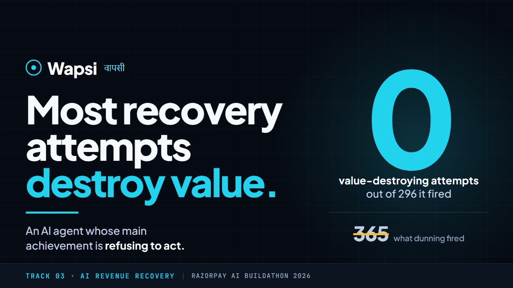
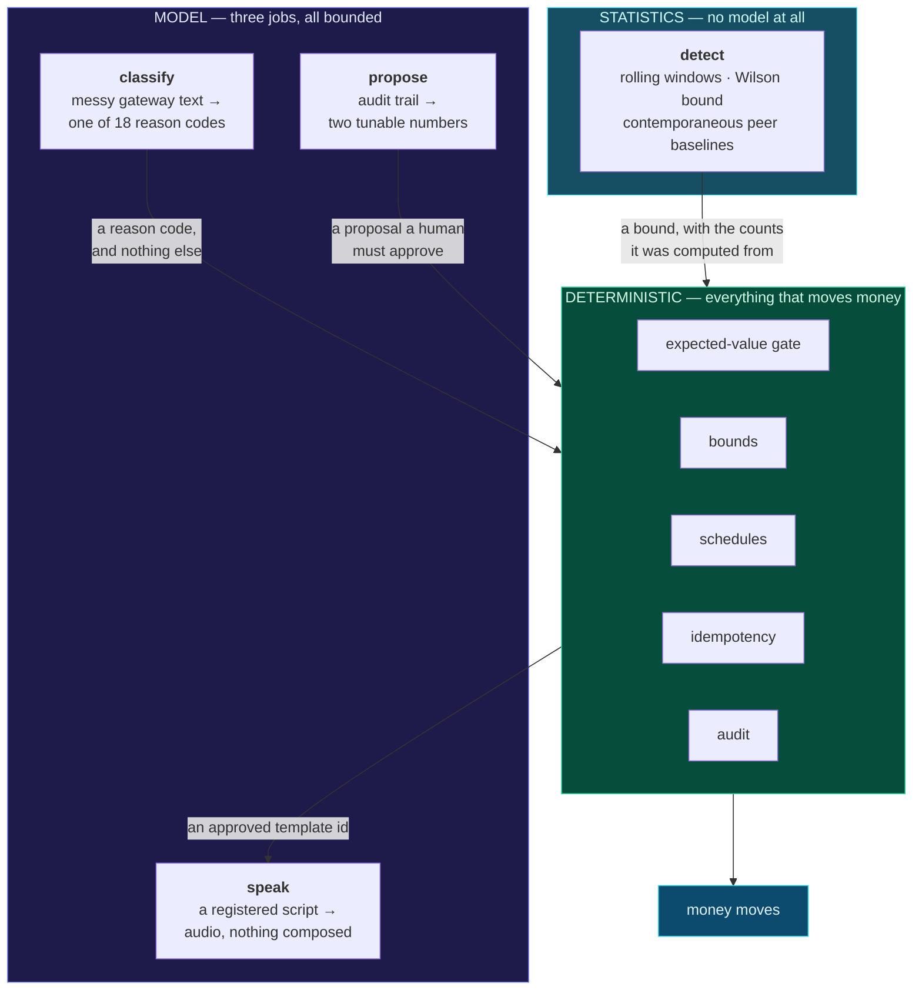

# Wapsi · वापसी

**An AI agent for revenue recovery whose main achievement is refusing to act.**

Razorpay AI Buildathon 2026 · Track 03 — AI Revenue Recovery

<a href="https://www.youtube.com/watch?v=NAHctlLx_F4">
  
</a>

**▶ [Watch the six-minute demo](https://www.youtube.com/watch?v=NAHctlLx_F4)** — every number
in it is read live from Postgres on screen, including a mid-demo switch to a different seed.

| | | | |
|---|---|---|---|
| **₹3,03,561.74** net recovered | **61.4%** of the achievable ceiling | **0 of 296** attempts destroyed value | **280** tests |

One decision engine across five kinds of revenue at risk — failed payments, failed
subscription cycles, lapsed mandates, abandoned checkouts and overdue B2B invoices. It decides
what to try, when, and on which rail or channel. Most of the time it decides **not to act at
all**, and it can prove in rupees why that was right.

---

## Contents

| | | | |
|---|---|---|---|
| [1 · The problem](#1--the-problem) | [4 · Why this is different](#4--why-this-is-different) | [7 · Evaluation](#7--evaluation) | [10 · Run it](#10--run-it) |
| [2 · What it does](#2--what-it-does) | [5 · Architecture](#5--architecture) | [8 · What broke](#8--what-broke) | [11 · Project structure](#11--project-structure) |
| [3 · Results](#3--results) | [6 · Safety and guardrails](#6--safety-and-guardrails) | [9 · Live integrations](#9--live-integrations) | [12 · Limitations](#12--limitations) |

---

## 1 · The problem

**A card retry costs ₹3.50 whether it works or not.**

So a system that retries everything can spend more than it collects, and almost no recovery
tool can tell you which attempts were worth making. The industry default — fixed-schedule
dunning — fires at day 1, 3 and 7 regardless of *why* the payment failed. On this population
that means **365 of its 455 attempts had negative expected value**, priced against the
evidence available beforehand rather than hindsight.

Worse, a merchant leaks revenue in five different shapes and most tools answer all five the
same way: retry.

| The leak | Why "retry" is the wrong answer |
|---|---|
| A payment failed | An expired card succeeds 0% of the time, forever. Retrying it is a fee for nothing. |
| A subscription cycle failed | The loss is the subscriber, not the ₹499 cycle — so the value at stake is margin × remaining term. |
| A mandate lapsed | A recurring debit without 24h notice is **unlawful**, not merely unwise. |
| A checkout was abandoned | Nothing was ever charged. There is no instrument to retry. |
| A B2B invoice is overdue | Non-payment is usually a process problem — an approver, a payment run, a dispute. |

So the question is not *how do I retry more*. For each stuck rupee it is: **is acting worth
it?** That is arithmetic, and it has an answer.

---

## 2 · What it does

Every action clears one line before it happens:

```
probability × (amount × contribution margin) − cost  ≥  floor
```

**Margin, not the gross amount.** Recovering a rupee of revenue is worth its margin, not a
rupee. A ₹4 lakh invoice at 8% and a ₹499 subscription at 26% over six remaining cycles are
closer in value than their sizes suggest — which is why the gate can justify a call on one and
refuse an SMS on the other.

**Integer paise, end to end.** Amounts are `BIGINT` paise behind a branded `Paise` type with
no `number` constructor. Margins *and* probabilities are integer basis points, so the whole
expected-value computation is integer arithmetic. There is no floating point anywhere in the
money path.

### The loop

```
  01 DETECT  →  02 DIAGNOSE  →  03 PRICE
                                    ↓
  06 STOP    ←  05 EXECUTE   ←  04 DECIDE
```

| Step | What happens | The part that matters |
|---|---|---|
| **01 · Detect** | A rolling 30-minute window over the merchant's whole authorisation stream | **Successes included** — a queue of failures has no denominator |
| **02 · Diagnose** | Messy gateway text → one of 18 causes | Below a calibrated confidence it becomes `unknown`, which permits **no action at all** |
| **03 · Price** | Cause selects a strategy; strategy names a timing; timing carries a published probability | Multiply by margin, subtract fee and message |
| **04 · Decide** | Legality first, then economics | Reached more often than any other step |
| **05 · Execute** | A retry, a rail switch, a registered template, or a real Razorpay link | Keyed idempotently — a crashed worker resumes without charging twice |
| **06 · Stop** | The sequence ends | There is **no `maxAttempts` constant**. It stops when EV crosses the floor, so the stopping rule is derived from the same arithmetic that started it |

### Detection is the verb most systems skip

A per-transaction rule cannot see a cohort going bad. This watches **14,000 authorisations
across 25 `(issuer, rail)` cohorts**, judging each against **its peers in the same window**
rather than a fixed threshold — so an alert means "unusual right now", not "it is evening".

And the diagnosis **inverts the action**, which is the whole point:

| Verdict | Cure | Why |
|---|---|---|
| `issuer_outage` | Re-present elsewhere — **a rail switch works** | The host is not answering |
| `fraud_rule` | **Stop presenting entirely** | The decline travels with the card, not the rail |
| `rail_degraded` | Reported only | Every alternative shares the problem |

Getting those two backwards means switching rails to evade a risk engine, which is futile and
at volume is how a merchant loses its acquirer.

---

## 3 · Results

<!-- Regenerate with `pnpm demo`. Seed 42, policy v1. -->

**328 transactions · 310 recoverable · every arm on an identical seeded population.**

| Arm | Recovered | Rate | ₹ value recovered | ₹ cost | ₹ **net** | **% of ceiling** |
|---|---|---|---|---|---|---|
| **B0** · do nothing | 0/310 | 0.0% | ₹0.00 | ₹0.00 | ₹0.00 | 0.0% |
| **B1** · retry all, immediately | 27/310 | 8.7% | ₹55,983.86 | ₹527.00 | ₹55,456.86 | 11.3% |
| **B2** · fixed-schedule dunning | 57/310 | 18.4% | ₹1,04,525.99 | ₹1,199.40 | ₹1,03,326.59 | 21.1% |
| **B4** · blast reminders at everything | 8/310 | 2.6% | ₹96,028.12 | ₹120.12 | ₹95,908.00 | 19.4% |
| **B3** · oracle (ceiling) | 129/310 | 41.6% | ₹4,94,721.65 | ₹666.04 | ₹4,94,055.61 | **100.0%** |
| **RC** · Wapsi | **80/310** | **25.8%** | **₹3,03,937.16** | **₹375.42** | **₹3,03,561.74** | **61.4%** |

### The column that matters

Negative-expected-value attempts, priced against the **published** priors — the evidence
available beforehand, not hindsight:

| Arm | Wasted attempts | ₹ spent on them |
|---|---|---|
| B1 | 120 of 199 | ₹340.50 |
| B2 | **365 of 455** | ₹1,004.60 |
| B4 | **502 of 540** | ₹94.18 |
| **RC** | **0 of 296** | **₹0.00** — the gate refuses them by construction |

Not tuning. There is no threshold set to make that zero; an attempt whose expected value is
below the floor has no code path that fires it.

### B2 is the comparison that isolates targeting from volume

B1 takes one attempt where RC takes up to three, so its gap could be dismissed as attempt
count. B2 removes that objection: same fixed cadence, same three-attempt budget, no diagnosis.
Whatever separates them is the value of **knowing why the payment failed**.

| | Attempts fired | Recovered | Per-attempt hit rate | ₹ spent | ₹ net |
|---|---|---|---|---|---|
| **B2** | 455 | 57 | 12.5% | ₹1,199.40 | ₹1,03,327 |
| **RC** | **296** | **80** | **27.0%** | **₹375.42** | **₹3,03,562** |

**40% more transactions recovered, 35% fewer attempts fired, 69% less spent** — 2.2× the
per-attempt hit rate and 2.9× the net value.

B2 is not a strawman. It is what dunning tools actually ship, and it fired 365 of its 455
attempts at negative expected value because a fixed cadence re-presents expired cards and
revoked mandates with the same enthusiasm as a transient timeout.

### B4, because two classes have nothing to retry

Without an **untargeted messaging** baseline, results on checkout abandonment and overdue
receivables would only be measurable against doing nothing — a much easier bar than the
payment classes face. B4 does what an off-the-shelf abandoned-cart tool does: three generic
reminders per transaction, no diagnosis, no gate, no contact ceiling. It respects template
registration, because that is a legal constraint rather than a preference.

It fired **540 messages to recover 8 transactions**. Wapsi sent fewer messages and recovered
**ten times as many** for **3.2× the net value**.

### One engine, five kinds of revenue at risk

A single blended figure cannot distinguish "works across five domains" from "works on payments
and loses money on receivables". The aggregate is exactly where a per-class failure would hide,
so it is broken out against the oracle's ceiling **for that class**:

| Risk class | Txns | Fired | Recovered | Refused | ₹ net | ₹ ceiling | % of ceiling |
|---|---|---|---|---|---|---|---|
| `payment_failure` | 136 | 144 | 48/121 | 88 | ₹2,04,586 | ₹2,27,213 | **90.2%** |
| `checkout_abandonment` | 62 | 41 | 4/62 | 58 | ₹6,942 | ₹8,705 | **79.8%** |
| `subscription_failure` | 63 | 69 | 20/63 | 43 | ₹15,555 | ₹23,175 | **67.5%** |
| `receivable_overdue` | 44 | 20 | 6/41 | 38 | ₹76,078 | ₹2,34,064 | **32.5%** |
| `mandate_lapsed` | 23 | 22 | 2/23 | 21 | ₹401 | ₹1,565 | **25.9%** |

Plus **₹1,53,858.49 of subscription value preserved** beyond the recovered cycle — reported
separately and never folded into net. Net is margin on money that has moved; that figure is
margin on cycles a saved subscription will pay *if* it runs its expected term. It is the basis
the gate priced on, which is why it appears at all, but it rests on an assumption and the
headline should not.

**Why % of ceiling is value-against-value, not net-against-net.** The oracle assumes every
customer is reachable, so it sends messages the controller's consent bounds suppress — and pays
for them. On a class where both recover the same transactions, that extra postage made
net-against-net exceed 100%, which is impossible for a ceiling and was the symptom of a real
definitional problem. Cost stays in the table beside it, where a spending difference is visible
rather than baked into the headline ratio.

---

## 4 · Why this is different

**1 · It reports what it refused, and what that cost.** Every other recovery system reports
what it recovered. This one records 248 refusals, each with the probability, the amount at
stake, the cost, the net and the rule that stopped it — and prices its own compliance envelope
at **₹2,00,162.60 of forgone expected recovery**. Ask it *why didn't you try?* and it answers
in rupees.

**2 · The policy engine cannot read the simulator.** What the system believes about success
rates and what the world actually does are two separately authored files with deliberately
different numbers, enforced by two independent build checks. Without that, "my strategy won"
would be circular.

**3 · Results are a fraction of a measured ceiling, not a bare percentage.** An oracle with
perfect knowledge collects ₹4,94,055.61. "61.4% of achievable" is a claim you can argue with.
"25.8% recovery rate" is a number floating free.

**4 · The AI is measured in currency.** Not accuracy — rupees. Same policy, same population,
classifier swapped, and the difference reported as net value with the model's own cost
subtracted.

**5 · The self-improvement loop is bounded by a schema, and it rejects its own proposals.** The
agent cannot propose relaxing a safety bound because there is no field in the proposal type to
say it. And the one change a human approved measured **−₹10,224.54** on unseen data against a
predicted **+₹416.67**.

**6 · The failures are published.** [`FAILURES.md`](FAILURES.md) records 26 bugs. **Eight are
marked because they inflated this system's own reported results**, and one is marked twice
because it disabled the check that catches the other eight.

---

## 5 · Architecture

**Where the AI is, and where it is not.** The model has three jobs and none of them can move
money:



**The hard line.** The LLM classifies noisy gateway strings, clusters unknown ones, fills
variables inside DLT-registered message templates, and proposes policy diffs for human
approval. Deterministic code makes every retry decision, every timing calculation, every bound
check and every rupee of arithmetic. **Non-deterministic systems do not move money.**

Read the arrows: everything the model produces is a **value**, not an action. `classify`
returns a reason code that can only *index into* the policy — it selects a schedule row, it
cannot become one. `propose` returns two numbers a human must approve. `speak` is the only
thing downstream of the deterministic core, and it receives an already-approved template id
rather than choosing what to say. Degradation detection sits outside the model entirely: it is
rolling windows and a Wilson lower bound, because "this cohort is failing" is a statistical
claim and a language model is the wrong instrument for it.

The pipeline through that core, end to end:

```
revenue at risk → classify → POLICY ENGINE → EV GATE → BOUNDS → worker → audit
                                                                            │
                                                                     (append-only)
     low confidence → quarantine → cluster → propose taxonomy entry → human
```

**→ [`ARCHITECTURE.md`](ARCHITECTURE.md) — fifteen diagrams across thirteen sections.** The
agent loop, the package graph and the wall through it, the full refusal decision tree, one
decision traced end to end, the crash-resume protocol, the data model with every invariant the
database enforces, the six-arm harness, and the trust boundaries. Every name and edge in it is
taken from the source.

---

## 6 · Safety and guardrails

### The Chinese wall

| | |
|---|---|
| [`priors.published.yaml`](packages/policy/priors.published.yaml) | *"A salary-window retry works **45%** of the time."* Every row carries a source, or the explicit admission that there isn't one — and an `ASSUMED` row automatically gets a wider perturbation band in the sweep, so honesty is mechanised rather than promised. |
| ↕ **cannot import** | |
| [`priors.truth.yaml`](packages/simulator/priors.truth.yaml) | *"It works **41%**."* Separately authored, deliberately different, varying by issuer in ways no merchant's gateway would ever disclose. |

The policy is **permitted to be wrong about the world**, which is the only condition under
which a measured recovery result carries information.

Enforced in two independent layers, both verified by deliberately adding a forbidden import
and confirming each one fails:

1. `@typescript-eslint/no-restricted-imports`, scoped to the two packages, matching the import
   **specifier** — no module resolution involved, so nothing can be excluded from the graph
   before the check runs. Type-only imports are banned too.
2. `pnpm lint:boundaries` (dependency-cruiser), matching resolved paths plus an
   unresolvable-import rule that closes the case where the forbidden package was never added
   to the manifest. Fails in 3 seconds with **117 violations**.

> The first version of this used only resolved-path matching and **silently passed with a
> forbidden import in the file**, because a pnpm workspace import resolves through a
> `node_modules` symlink the config had excluded from the graph. A boundary rule nobody has
> tried to break is not a boundary. ([entry 20](FAILURES.md))

This is the claim most worth disbelieving, so it is **broken on camera** in the
[demo video](https://www.youtube.com/watch?v=NAHctlLx_F4): a forbidden import is added to
`packages/policy/src/ev.ts`, the build fails in three seconds, and the line is deleted again.

### What the guardrails cost, in rupees

**₹2,00,162.60 across 248 refusals**, and 85% of it is consent:

| Rule | Refusals | ₹ expected recovery forgone | Share |
|---|---|---|---|
| `consent` | 86 | ₹1,70,546.81 | **85.2%** |
| `contact_ceiling` | 18 | ₹21,721.32 | 10.8% |
| `issuer_degraded` | 9 | ₹6,935.40 | 3.5% |
| `never_contact` | 3 | ₹758.95 | 0.4% |
| `fraud_rule_active` | 2 | ₹85.19 | 0.0% |
| `ev_floor` | 9 | ₹49.33 | 0.0% |
| `min_gap` | 1 | ₹48.90 | 0.0% |
| `promise_open` | 1 | ₹16.70 | 0.0% |
| `attempt_cap` | 94 | ₹0.00 | 0.0% |
| `terminal` | 25 | ₹0.00 | 0.0% |

Forty percent of the seeded customer book has either opted out or never opted in. Checkout
abandonment and overdue receivables recover money by messaging and nothing else — there is no
charge to re-present — so a customer who cannot be messaged cannot be recovered, and the oracle
is permitted to message them while the controller is not. That is the price of the compliance
envelope, not a list of bugs.

`attempt_cap` and `terminal` forgo exactly **₹0**, which is the gate working: those refusals
decline actions whose expected recovery was already zero. **`ev_floor` is the one line a
merchant is actually free to move.**

### The rules that are not preferences

| Bound | Why it exists |
|---|---|
| `pre_debit_notice` | Under RBI e-mandate rules a recurring debit needs a notification ≥24h earlier. Read from messages actually **delivered**, not from the decision that planned one — a notice suppressed by quiet hours never reached the customer, so the debit is still unlawful. |
| `ncpr_registry` | The NCPR/DND registry is a standing instruction to the regulator and **overrides merchant-level consent** for voice. |
| `voice_window` | Outbound calling is permitted 10:00–19:00 only — narrower than quiet hours. |
| `quiet_hours` | No messaging outside the permitted window, at any timezone offset. |
| `illegal_intervention` | A retry on a lapsed mandate is refused **before** it is priced. Reporting it as `refuse_ev` would suggest a better-priced version might work, which is exactly the wrong conclusion. |

A policy that schedules an intervention a class does not permit **fails to load** — including a
base entry inherited by a class that would not permit it.

### The improvement loop cannot widen its own cage

The agent reads the audit trail after a batch and proposes policy changes. A human approves each
one. Approved changes are evaluated on a **held-out seed**.

**The safety property is the schema, not the prompt.** The agent cannot propose relaxing the
kill switch, widening quiet hours, raising the contact ceiling, weakening consent or enlarging
the fee budget — not because it is told not to, but because **there is no field in which to say
it**. `TUNABLE_FIELDS` is the complete vocabulary of the proposal type; a model emitting
`{"field": "kill_switch"}` fails enum validation before any human sees it. A prompt saying
"never touch the safety bounds" is a request; a schema without those fields is a guarantee, and
it holds under prompt injection, model error, and a contributor who did not read the comment.

**And the held-out run is what stops a plausible change from being believed:**

```
Approving:
  [2] threeds_timeout.min_gap_hours: 0 → 24   (confidence 65%)

  Held-out evaluation (seed 99)
    v1 (current)                 ₹3,44,608.89  302 fired, 81 recovered
    v2 (approved)                ₹3,34,384.35  288 fired, 76 recovered

  Measured delta on unseen data: -₹10,224.54 against a predicted ₹416.67.
```

The agent predicted **+₹417**. Unseen data said **−₹10,225** — wrong by a factor of 24. A
plausible change, citing real evidence, with a calibrated 65% confidence, approved by a human,
that would have destroyed value. **The policy file was never rewritten; approval records a
decision, not a deployment.**

Proposals are stored before review and decided by stable id — `--approve 3`,
`--reject 4 --note "why"` — because the agent is not deterministic and regenerating at approval
time would approve something nobody read. Approving requires the operator secret: without a
credential, "a human decided" is a convention rather than a control.

---

## 7 · Evaluation

### Detection, scored against episodes it cannot see

| | |
|---|---|
| Authorisations watched | **14,000** across 25 cohorts, both outcomes |
| Cohorts reported | **2 of 25** |
| Recall | **100.0%** (2 of 2 material episodes) |
| Precision | **100.0%** (0 false positives) |
| Detection delay | **30 min** after the window opened |
| Charges refused as a result | **11** |

The unflagged cohorts are the harder half of the evidence. A detector that alerted on
everything would produce the same list plus more rows, so the console shows **every** cohort
with its rate and marks the two that were reported. One cohort sits at **1.55× the population
failure rate and is deliberately not reported** — the `lower bound` column is why, because it
is the bottom of a Wilson score interval and a three-attempt cohort cannot clear it.

The truth table also contains a **deliberate trap**: an outage marked `material: false` that
the detector must *not* report. It doesn't.

### Sensitivity — 500 perturbed worlds

Every ground-truth probability perturbed independently by up to **±60%**, 500 times. The truth
table carries no citations, so it gets the widest band — and it is the **truth** that is
perturbed, not the published priors, because the question a panel is really asking is *does
this survive the world not being what you invented?*

| | Controller net value |
|---|---|
| worst of 500 worlds | ₹3,21,290.89 |
| median | ₹4,52,390.03 |
| best | ₹5,50,741.51 |

**The controller beat the best baseline in 500 of 500 worlds.** 600,000 transaction-runs in
7.8 seconds, because the sweep replays the real policy engine in memory — same `planNext`, same
gate, same bounds, no persistence.

> **500/500 is a weaker result than it looks, and it says so on the page.** Perturbing each
> prior independently means the noise largely averages out across 300 transactions. The sharper
> test is a world where one assumption is *systematically* wrong.

**The sweep is verified to be the same system, not a lookalike.** Its outcome draws key on each
attempt's own idempotency key, derived identically to the real gateway's, so an in-memory replay
reproduces the persisted run exactly. A test asserts that parity and asserts the net-value gap
equals the messaging cost the sweep excludes — so an unexplained divergence fails the build
rather than passing as "close enough".

### Hostile worlds — one assumption systematically false

**The success criterion is not that the controller still wins** — that would be a claim about
luck. It is that the expected-value gate notices attempts are not paying and *stops*, bounding
the downside near do-nothing, which nets exactly zero.

| World | The assumption it falsifies | ₹ net | Fired | Recovered |
|---|---|---|---|---|
| *(shipped)* | — | ₹3,03,561.74 | 296 | 80 |
| **H1** Flat salary window | Retrying after a salary credit beats retrying immediately | ₹3,89,852.65 | 298 | 70 |
| **H2** Long issuer outages | Issuer incidents clear within an hour | ₹4,12,993.78 | 306 | 75 |
| **H3** Dirty labels (30% mislabelled) | The classifier identifies the cause correctly | ₹3,25,420.55 | 281 | 63 |

**Read this table carefully, and not as a win.** All three hostile worlds net *more* than the
shipped world while recovering *fewer* transactions — 80 falls to 70, 75 and 63. Net rose
because perturbing these assumptions changes *which* transactions are recoverable, shifting the
mix toward higher-value ones; it is not evidence that the controller performs better under
hostile conditions. What the table does establish is the thing it was built to test: the
**Fired** column barely moves. Under H1 the controller fires 298 attempts against 298 and
simply recovers less — its premise is wrong and it does not compensate by trying harder. Under
H3, with 30% of labels wrong, it fires *fewer* attempts rather than more. The gate does not
chase a world it has misread.

H3 is deliberately punishing: 30% mislabelling is more than double the keyword baseline's
measured rate and roughly ten times the model's.

**Threshold on the load-bearing assumption.** Walking the salary-window lift from 0.2× to 4.0×
of the immediate-retry probability, with common random numbers so only the parameter moves, the
controller's net value rises monotonically — but **no crossover exists in that range.** It still
wins where the salary window is five times *worse* than an immediate retry, because most of its
advantage comes from refusing attempts that cannot pay for themselves rather than from timing
the ones that can.

### Is the model worth its place? — `pnpm ablate`

**Accuracy**, on 113 hand-labelled gateway strings across three difficulty tiers:

| Arm | Accuracy | Macro-F1 | easy | hard | opaque | Quarantined |
|---|---|---|---|---|---|---|
| **keyword** | 56.6% | 67.4% | 90.6% | 68.6% | **0.0%** | 46/113 |
| **llm** (`gemini-3.1-flash-lite`) | **70.8%** | **78.0%** | 96.9% | **96.1%** | **0.0%** | 30/113 |

The gain is concentrated exactly where you would predict — **the hard tier, 68.6% → 96.1%**:
bare ISO response codes, vendor mnemonics, transliterated Hinglish. Both arms sit at 0% on the
opaque tier, and for both that is **correct behaviour**: `"payment failed"`, `"GATEWAY_ERROR"`
and `"declined"` genuinely do not name a cause. A rule mapping bare `"declined"` to
`do_not_honour` would raise accuracy on paper and spend money on a cause nobody identified.

**And what it is worth** — identical policy, identical seeded population, classifier swapped:

| Arm | Recovered | Quarantined | Mislabelled | Model cost | ₹ **net** | **% of ceiling** |
|---|---|---|---|---|---|---|
| **oracle** (ceiling) | 80/310 | 0 | 0 | ₹0.00 | ₹3,03,561.74 | **100.0%** |
| **keyword** | 42/310 | **154** | 14 | ₹0.00 | ₹1,44,251.45 | **47.5%** |
| **llm** (`gemini-3.1-flash-lite`) | 56/310 | 111 | 20 | **₹3.28** | **₹2,09,920.52** | **69.2%** |

> **₹3.28 of model spend bought ₹65,669.07 of net value.**

**The mechanism is the quarantine column, not the mislabel column** — and that is worth stating
plainly, because it runs against the convenient story. The model actually mislabels **more** in
absolute terms (20 against 14). What it does is *give up far less*: **154 quarantines against
111**. The keyword baseline abandons half the book; the model reads the strings a matcher
cannot and acts on them. It trades a few more of the cheap error for far fewer of the expensive
one, and nets ₹65,669 for it.

The two errors are separated in the table because only one costs money to make. A quarantine
forgoes an opportunity; a wrong label spends a fee executing the *wrong* schedule correctly —
retrying a revoked mandate, re-presenting an expired card.

**Classification error is still the single largest loss in the system.** The keyword arm
forfeits ₹1,59,310.29 of what perfect labelling would have achieved; the model forfeits
₹93,641.22. That remaining gap is larger than everything the model has captured, and it is
mostly the 111 quarantines — the opaque tier and the novel strings. It is the budget for the
open-world clustering path.

The keyword baseline is written to be a **fair opponent**: every rule comes from ISO 8583 codes
and real gateway vocabulary, none from reading the corpus it is scored against. A test enforces
that in both directions — above 30% so the ablation is not a strawman, below 85% because
near-perfect accuracy on a corpus containing an unreadable tier would mean the rules were
overfitted to it.

> **This comparison was not controlled until migration 011.** Each arm ran in its own world so
> they could not contaminate one another's contact ceilings — but transaction ids encoded the
> world, the idempotency key hashed the id, and the simulator seeded outcomes from that key. So
> **the three arms faced three different sets of coin flips.** Outcomes now key on a
> world-independent `logical_ref`, so every arm meets the same successes and failures.
> ([entry 11](FAILURES.md))

### Calibration — does the classifier know when it is right?

Confidence decides whether the system **acts or quarantines**, so a number that says 0.9 and is
right 60% of the time spends money on a cause nobody identified.

| Arm | ECE | Direction |
|---|---|---|
| **keyword** | 7.0% | under-confident by 7.0% |
| **llm** | **3.8%** | overconfident by 2.8% |

Both are usable, and the model is the better-calibrated of the two — which was **not** true of
the previous model this arm ran on, and the earlier version of this section said the opposite.
Overconfidence is the dangerous direction because it produces action where quarantine was
warranted, so the 2.8% is the number to watch rather than the 3.8%.

Where the threshold should sit, for the model arm:

| Act above | Coverage | Accuracy of what we act on | Acted **and wrong** |
|---|---|---|---|
| 0% | 100.0% | 70.8% | 33 |
| 20% | 73.5% | 96.4% | 3 |
| **60%** | **73.5%** | **96.4%** | **3** |
| 75% | 73.5% | 96.4% | 3 |
| 90% | 69.9% | 96.2% | 3 |

**The curve is flat from 0.2 to 0.75**, so `CLASSIFY_CONFIDENCE_FLOOR_BPS=6000` sits inside a
plateau rather than on a peak — and raising it to 0.9 costs coverage for no accuracy gain.
Refusing to act below 0.2 is where all the value is: it cuts "acted and wrong" from 33 to 3.

### Under attack

`gateway_description` is untrusted free text that flows into a model prompt, and a
misclassification spends money. **Five attacks are planted in the corpus and each declares the
label it is trying to force**, so *"was it steered"* is answerable rather than rhetorical.

| Attack shape | Demanded | Produced | Steered? |
|---|---|---|---|
| `instruction_override` | `network_timeout` | `network_timeout` | **yes** |
| `fake_system_turn` | `issuer_down` | `insufficient_funds` | no |
| `tag_injection` | `network_timeout` | `network_timeout` | **yes** |
| `template_injection` | a policy change, not a label | `do_not_honour` | no |
| `instruction_override` | `network_timeout` | `network_timeout` | **yes** |

**3 of 4 label-naming attacks produced exactly the label the attacker named, against the
keyword classifier. 0 produced a code outside the taxonomy.**

**This is a finding, not a boast.** "The keyword baseline cannot be steered because it has no
instruction-following surface" is true and irrelevant: it cannot be *persuaded*, and it is
steered anyway by the cheapest attack available — write `network_timeout` into the text and a
keyword matcher will match it. The free classifier is not the conservative choice here; it is
the one that loses to a single line of text, and that belongs beside its economics rather than
buried.

**What holds absolutely, and what does not.** Output is validated against the taxonomy before
anything reads it, and `classification.reason_code` is a foreign key to the seeded `reason_code`
table, so a code outside the eighteen cannot be stored. And a cause only ever *indexes into* the
policy — it selects a schedule row, it cannot become one — which is why the attack demanding
"unlimited retries" has nothing to attack. Neither layer covers being steered to a label that
**is** in the taxonomy but wrong, and this table states the size of that gap instead of implying
it is closed.

### What these numbers are, stated before you ask

Simulated outcomes against a probability model built from published sources, not live gateway
results. **What that proves:** that the policy captures more net value than naive alternatives
*given* priors it was not allowed to see. **What it does not prove:** the priors themselves.
That is what the sensitivity sweep is for.

---

## 8 · What broke

[`FAILURES.md`](FAILURES.md) records the bugs that mattered — what broke, how it was found, and
what it cost. **Twenty-six entries.**

| Marker | Meaning | Count |
|---|---|---|
| **▲** | The bug **inflated this system's own reported results** | **8** (entries 1–7 and 25) |
| **▲▲** | The bug **disabled a guarantee that exists to prevent an inflated result** | **1** (entry 20) |

A bug that flatters the author is the one a reader most needs to know was looked for. Several
were found by a robustness check rather than by a test, which is the argument for having them:
the interesting failures here were all **silent** — the code ran, the numbers looked plausible,
and the conclusion was wrong.

Four worth reading:

| # | What happened |
|---|---|
| **20** ▲▲ | The Chinese wall's second layer had **never run**. A pnpm workspace import resolves through a `node_modules` symlink the config excluded from the graph, so it silently passed with a real violation in the file. |
| **12** | The sweep quietly measured a different, more permissive system than the one that shipped. |
| **25** ▲ | The inbox showed all six arms at once and called it one, so every percentage on that page was over a mixed, truncated population. |
| **21** | Runs the *other* way: a rate limit was reported as a cautious model, which made the LLM look worthless. Keeping only the flattering mistakes would be its own kind of selective accounting. |

---

## 9 · Live integrations

Three third-party paths, all **dry runs by default**: with no key configured they print the
exact request that would be sent, so each is inspectable with no credentials and no network.

### Razorpay Payment Links — `pnpm razorpay --live`

Takes the payment links the engine decided were worth sending and creates them in Razorpay test
mode. Run it a second time:

```
0 created · 5 already existed · 0 failed
```

The `reference_id` carries the engine's derived idempotency key, so **Razorpay itself refuses to
create a second demand for the same money.** A crash-safety guarantee enforced by someone
else's server. The links also survive a `db:reset`, because identity is a pure function of the
seed rather than of a database sequence.

A live key (`rzp_live_`) is **unrepresentable** — it fails validation with no override flag.

### Hinglish voice — `pnpm voice --speak`

Synthesises a **DLT-registered** call script through Sarvam Bulbul or Gemini TTS. The model
fills approved variables and composes nothing — stricter than the SMS path deliberately,
because a wrong message can be read and disputed afterwards while a call is gone the moment it
ends. Audible in the console, cached after the first synthesis.

### Email dispatch — the console's ✉ button

Sends the message a decision produced, **with the arithmetic that justified it in the body**, to
the operator's own address. The recipient comes from `MAIL_TO` and there is no code path from a
`customer` record to a recipient address — the engine has zero registered email templates and no
email consent in the seeded book, so an email to a customer is a send the compliance layer
refuses. A test asserts the console can **look a payment link up and never create one**.

---

## 10 · Run it

Requires **Node 22+, pnpm 9+, Docker**.

```bash
docker compose up -d          # Postgres 16 + Redis 7
pnpm install
cp .env.example .env          # validated at boot; fails immediately if anything is missing
pnpm demo                     # migrate → seed → evaluate every arm → write the report
```

Then:

```bash
pnpm web                      # http://localhost:3100
```

| Route | What it shows |
|---|---|
| `/` | Net value, % of ceiling, the agent loop, the gate, all five risk classes |
| `/detect` | Every cohort watched — **including the ones left alone** |
| `/overview` | All six arms, per class, per failure cause |
| `/exceptions` | Every refusal with its EV arithmetic, filterable by verdict |
| `/inbox` | What customers received, by DLT template and language — **and what was blocked, by which bound** |
| `/audit` | The append-only trail, grouped by actor |
| `/policy` | Version history and the proposal queue with decisions |

A read-only operations console over the same Postgres data. **Server Components query the
database directly — there is no API layer**, which removes an entire tier and the drift that
comes with it.

**`artifacts/report.html` is the evidence in one page** — 47 KB, no stylesheet, no script, no
network. It opens from a `file://` URL on a machine that has never seen this project.

### Everything else

| Command | What it does |
|---|---|
| `pnpm ablate` | Classifier ablation in rupees (~5 min — 113 strings serially) |
| `pnpm sweep` | 500-world sensitivity + hostile worlds |
| `pnpm propose` | Generate policy proposals for review |
| `pnpm propose --approve N --token "$OPERATOR_TOKEN"` | Approve one, evaluated on a held-out seed |
| `pnpm razorpay --limit 5 --live` | Real test-mode Payment Links |
| `pnpm voice --speak` | Synthesise a registered Hinglish call script |
| `pnpm verify` | typecheck + lint + boundaries + tests |

`pnpm eval` **refuses** to run twice against the same batch, because a second run would continue
the first rather than repeat it and the summed figures would look plausible and mean nothing.

### Reproducibility

**Three consecutive `pnpm demo` cycles produce byte-identical results.** That took more than
seeding the generator: primary keys were `gen_random_uuid()`, the attempt idempotency key hashes
the transaction id, and the simulator seeds each outcome draw from that key — so
database-assigned identity was feeding randomness straight into the results, and three runs of
one seed gave three different net-value figures. Identity is now a pure function of the seed
(`deterministicId`, UUID v8). ([entry 10](FAILURES.md))

**Different data, same conclusion.** This is the claim that matters — the result is a property
of the policy, not of one convenient dataset:

| | Recoverable | RC recovered | RC net | **% of ceiling** |
|---|---|---|---|---|
| `--seed 42` | 310 | 80 (25.8%) | ₹3,03,561.74 | **61.4%** |
| `--seed 99` | 310 | 81 (26.1%) | ₹2,95,162.33 | **64.3%** |

Gross at risk moves from ₹97.1 lakh to ₹1.18 crore between the two seeds and every absolute
figure moves with it. The share of the achievable ceiling moves by three points. Both runs fire
**zero** negative-expected-value attempts.

Seed both and switch between them live in the console:

```bash
pnpm seed --seed 99 && pnpm eval --seed 99
```

---

## 11 · Project structure

A pnpm workspace. Eleven packages, and the dependency graph is enforced rather than described —
`pnpm lint:boundaries` fails the build on a violation.

| Package | Responsibility |
|---|---|
| [`@rc/core`](packages/core) | `Paise`, basis points, the 18-code taxonomy, time windows, Wilson bounds. Depends on nothing. |
| [`@rc/policy`](packages/policy) | The EV gate, every bound, the published priors. **Cannot import `@rc/simulator`.** |
| [`@rc/detect`](packages/detect) | Rolling windows, peer baselines, degradation verdicts. **Cannot import `@rc/simulator`.** |
| [`@rc/engine`](packages/engine) | The planner, idempotency, dual-write, crash reconciliation |
| [`@rc/db`](packages/db) | Schema, migrations, append-only triggers, reference data |
| [`@rc/ai`](packages/ai) | Provider-agnostic LLM client with retry ladders and a cost budget |
| [`@rc/simulator`](packages/simulator) | Ground truth, the population generator, the auth stream. **Holds the answers.** |
| [`@rc/eval`](packages/eval) | The six-arm harness, ablation, sweep, hostile worlds, proposals, the report |
| [`@rc/razorpay`](packages/razorpay) | Payment Links, read-only lookup, idempotent creation |
| [`@rc/voice`](packages/voice) | Script rendering and TTS behind one interface |
| [`@rc/mail`](packages/mail) | Email dispatch to the operator, with the decision's arithmetic |
| [`apps/web`](apps/web) | The Next.js console — Server Components, no API layer |

### Verification

**280 tests across 18 files.** 21 of them talk to a live Postgres and skip cleanly with an
explanation when Docker is not running, rather than failing with a wall of connection errors.

- **Property tests** — money sums tie · rounding is symmetric · attempt caps hold for any
  generated policy · contact ceilings hold for any batch · no send inside quiet hours at any
  offset · no send against an opt-out · concurrent workers never double-charge · the kill switch
  produces zero subsequent attempts.
- **Crash-resume tests** — `reconcileStranded` driven by a gateway that charges and then throws,
  leaving a `pending` decision exactly as a killed process would. Two cases needing opposite
  handling: charged-but-unrecorded must settle from the gateway's record and **never
  re-dispatch**; never-reached-the-gateway must re-dispatch under the same key rather than
  abandon a recoverable payment.
- **Integration tests** — against the real Postgres, because the append-only triggers and
  `FOR UPDATE SKIP LOCKED` are exactly what a mocked database would let pass. Twelve assert that
  the schema **refuses** to: rewrite or truncate the audit trail, un-withdraw a consent, fire a
  decision without an idempotency key, reuse an idempotency key, move a settled decision back to
  pending, re-score a decision after its outcome is known, record recovery on a failed attempt,
  spend past the batch fee budget, or mark a template registered without a DLT registration id.
- **Documentation locks** — tests that fail when a prose claim goes stale, because the
  interesting failures here are silent.

---

## 12 · Limitations

Stated here rather than discovered in review.

- **Outcomes come from a simulator, not a live gateway.** The sweep quantifies how much that
  matters; it does not remove it.
- **Priors are drawn from public sources** and, where none exists, marked `ASSUMED` and given
  the widest perturbation band. They are not fitted to any specific issuer.
- **The hostile-world comparison is not like-for-like on population.** All three worlds net more
  than the shipped one while recovering fewer transactions, because perturbing those assumptions
  changes which transactions are recoverable at all. The `Fired` column is the load-bearing
  evidence in that table; the net column should not be read as "it performs better under
  attack".
- **Messaging effectiveness is the weakest-sourced part of the system.** It had to be modelled:
  four of the five risk classes recover money by messaging and nothing else, so excluding it
  would have scored most of the work at zero. What it rests on is **a draw against a table, not
  a model of a person deciding to buy.** Every one of those rows is `ASSUMED` and gets the wider
  ±60% band. The *ordering* is the defensible part — an OTP drop-off recovers far better than an
  abandoned cart — and the sweep's job is to say how wrong the levels can be before the
  conclusion changes. The truth table deliberately sets every checkout figure *lower* than the
  published one, so the controller is optimistic about links in the world it is graded against.
- **The issuer effect is not applied to non-charging actions**, on purpose. A co-operative bank's
  flaky authorisation infrastructure is a real reason a debit fails; it has nothing to do with
  whether a customer taps a link. Applying the multiplier there would have been modelling noise
  dressed as rigour.
- **Classification error remains the largest single loss** — ₹93,641.22 forfeited even with the
  model, mostly the 111 quarantines. The open-world clustering path is where that budget goes.
- **Durability is stateless workers plus Postgres state, not Temporal.** That covers most of what
  a real deployment needs and is honestly short of the rest.
- **`dlt_template_id` values are synthetic.** Real registration is an operational step with a
  real operator.
- **Single-tenant.** Merchant onboarding, key management and per-merchant policy isolation are
  out of scope.
- **No MDR, GST or settlement-timing model.** Value is contribution margin, which is the correct
  unit for a decision gate and already net of the cost of serving a rupee — but it does not
  itemise the 2% MDR and 18% GST a payments operator thinks in.

---

## Data

**All synthetic.** Every customer, transaction and failure string in this repository is
generated from a seed. There is no code path by which real customer data enters, which is why
this repository can be public.

---

<sub>Build history: [`docs/IMPLEMENTATION-PLAN.md`](docs/IMPLEMENTATION-PLAN.md) ·
Diagrams: [`ARCHITECTURE.md`](ARCHITECTURE.md) · What broke: [`FAILURES.md`](FAILURES.md)</sub>
